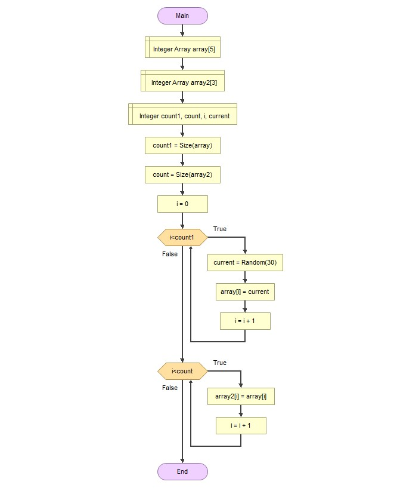

 # Решение задачи для контрольной работы

 **План**

1. Создание репозитория на GitHub
2. Создание блок-схемы алгоритма 
3. Заполнение текстового файла с описанием решения (файл README.md)
4. Создание программы, решающую поставленную задачу

*Задача*: Написать программу, которая из имеющегося массива строк формирует новый массив из строк, длина которых меньше, либо равна 3 символам. Первоначальный массив можно ввести с клавиатуры, либо задать на старте выполнения алгоритма. При решении не рекомендуется пользоваться коллекциями, лучше обойтись исключительно массивами. 

